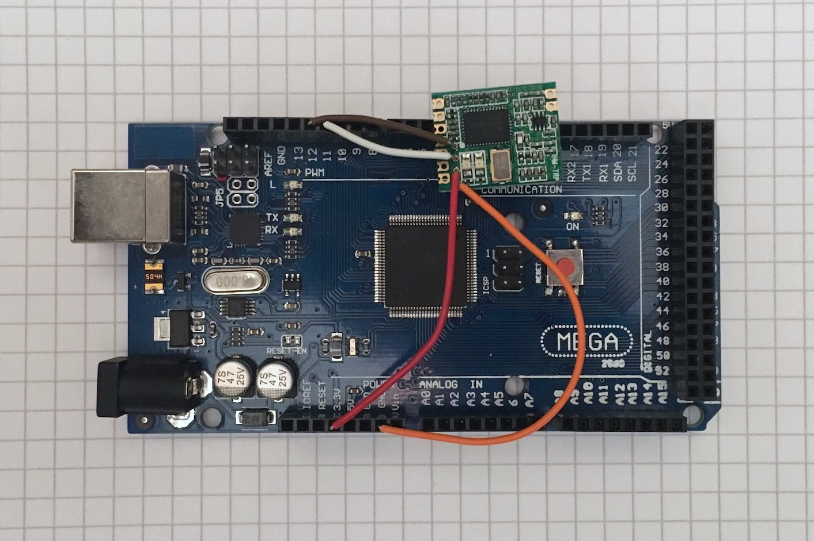

# c2prog

Use an Arduino to flash the Ardupilot bootloader to SiK radios via the C2 interface.

The Ardiuno sketch containts the SiK bootloader for HM-TRP based radios. Once the bootloader
is flashed to the radio, the latest firmware can be installed via the USB or serial port in
the usual way.

Based on the AVR code within https://github.com/x893/C2.Flash.
Which in turn is based on the code examples provided in
the orginal Si Labs application note, AN127 Rev. 1.1.

## Connections

```
  Arduino        HM-TRP
 ~~-------+    +-----------~~
          |    | O #:#:
          |    | O = +------+
          |    | O = |      |
          |    | O   |      |
      D12 | -----> o +------+  <- C2CK
      D11 | -----> o     +-+   <- C2D
     +3V3 | -----> o # # | |   <- VDD_MCU
      GND | -----> o     +-+   <- GND
 ~~-------+    +---^-------~~
                   |
                 C2 interface
                 This row of 4 holes.
```

Hook up the Sik radio board (such as the HM-TRP board) as per the connection diagram.
On some boards there is a row of 4 holes for the C2 interface through which breadboard hookup 
wire can be insterted.

**Be careful**: The Si1000 VDD_MCU is not 5V tolerant so only connect to the Arduino 3.3V output.
However, all other I/O including C2D and C2CK pins are 5V tolerant, and can be connected directly 
to the Ardiuno 5V I/O pins.



## Building

Build the `c2prog.ino` sketch with an Ardiuno IDE and flash to the Arduino.
The low level pin mappings should work with the Uno, Mega, Nano or Pro Mini, but other boards
may need to be remapped.
The code is tested for 16 Mhz boards, but for other boards the timming may need to be adjusted.
See [Porting](#porting).


## Keys

From a serial console:

* `D` Get Device ID
* `E` Erase Flash
* `B` Burn bootloader
* `V` Verify bootloader
* `W` Write Flash: `WAAAALLbb..bb`
* `R` Read Flash: `RAAAALL`
  
    where:
  
   `AAAA` = 16 bit start address in hex
  
    `LL` = length in hex, 0-256 bytes
  
    `bb..bb` = `LL` hex bytes to read or write


## Instructions

1) Connect a serial console to the Arduino at 115200 baud.
1) Press `D` to check Device ID: e.g. 1600 = Si100x, rev. A, 0000 = not connected.
2) Press `E` to erase flash.
3) Press `B` to burn the bootloader.
4) Press `V` to verify bootloader. The lock byte is not flashed to allow for verification, 
   so ignor the failure at address 0xFBFF.

Once the bootloader is installed, connect to the radio via its serial interface 
and install the Ardupilot Sik firmware in the usual way.

For example, using the [SiK tools](https://github.com/ArduPilot/SiK):
```
    python uploader.py --baudrate 115200 --port /dev/ttyUSB0 radio_hm_trp.ihx
```
Or using a ground station such as Mission planner, see the Ardupilot docs:
[upgrading-radio-firmware](https://ardupilot.org/copter/docs/common-3dr-radio-advanced-configuration-and-technical-information.html#upgrading-radio-firmware).

The latest firmware can be downloaded from: https://firmware.ardupilot.org/SiK/

## Porting

The timming for the C2CK pluse is the most critical. The code is tested for 16 Mhz boards,
but for other frequencies the timing of `Pulse_C2CLK()` may need to be padded with additional NOP's.

```

     C2CK line pulse timing

     C2CK ---+--------\          /-------------\         /
             |        |\        /|             |\       /
             |        | \------/ |             | \-----/
      driver |        |          |             |
        on ->+<------>+<- t_CL ->+<-- t_CH --->+
               >40ns   80ns - 5us    >120ns

 ```
To generate C2CK clock strobes with a microcontroller-based programmer:

   1. Turn the C2CK driver on.
   2. Wait at least 40 ns. This helps ensure C2D data setup time.
   3. Force C2CK low. Ensure interrupts are disabled at this point.
   4. Wait between 80 and 5000 ns.
   5. Force C2CK high.
   6. Wait at least 120 ns. This helps ensure C2D data valid time.

```
void Pulse_C2CLK(void)
{
  C2CK_PORT &= ~C2CK_BIT;
  asm volatile("nop\n\t");
  asm volatile("nop\n\t");
  C2CK_PORT |= C2CK_BIT;
}
```

